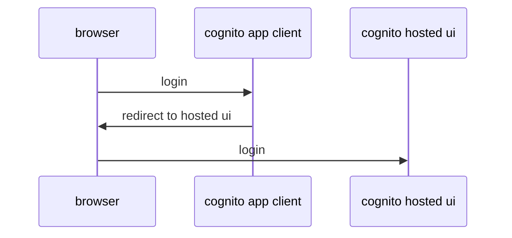

Need to rewrite the pomo app for aws serverless. Here are a bunch of questions to consider.
## Authentication
Using API gateway and Cognito user pools. These can be connected together, so that api gateway does the authetnication, and the lambda can focus on business logic. 
[SAM example template](https://docs.aws.amazon.com/serverless-application-model/latest/developerguide/serverless-controlling-access-to-apis-cognito-user-pool.html)
Note that the cloud formation resourced `UserPoolClient` is the same as Cognito User Pool App Client.
### Tokens, tokens
ID token holds the information about the user. Access token sent with all api requests. Refresh token to regenerate all tokens. When one signs in to the User pool you get all 3 tokens for your use. You can authenticate API calls with id or access tokens.
[API GW: using user pools](https://docs.aws.amazon.com/apigateway/latest/developerguide/apigateway-integrate-with-cognito.html)
### Google idp
It looks like you could connect the existing google identity defined to the user pool You define the identity provider, and the provider is then connected to the user pool.

Using the programmatic example seems the easiest as you don\t need to worry about the sign-up. Just use sign-in programmatically. Hopefully the google credentials can be integrated as wwll. Well, they could not. IdPs require that the hosted ui is acivated. You need to use the redirext flow. It is possible to bypass the aws ui and go directly to google. AWS authenticates as the app to google, and then prents itself as the authority to your app. The recommendation is to use the authorization code flow, where you get an auth code that you then exchange with the tokens.

Now obviously the easiest is to go with user pool native tokens. Alternatively, you load the app whixh directly redirects you to the authentication flow.The redirext uri then needs to point baxk to the applifcation, whixh inspects the query paramters to detemine whether it has the code. If it has, exchange it with the token and start working.
The atuhentication flow produxes an authentixation code, that is then programmatically exchanged for token using an api call.

## DynamoDB
There are two cloudfromation resource types for dynamodb: A **sam** simple table with a single-field primary key, and then the more general dynamodb table spec. The selection on which to use should be obvious once the primary/sort key structure is clear.

DynamoDB has the same structural issue as RDBs. You need to decide how the tables are created that your app needs for operation. This is an "migration" type of operation. You can either write aws command line scripts and have them executed using make or write, or use cloudformation. Both for development. Note that the table creation only needs to define the keys that are used for the primary key.

Also, dynamodb does not handle createdAt/updatedAt fields automatically. You need to programmatically handle this. This is also a thing you need to decide, is it part of the business logic? Probably not, but it would be nice to see when an item was last modified.

The primary key design's primary goal is to distribute load among different partitions in order to not create hot spots for the database. For a simple app like pomo, this is of little significance, but nevertheless it is good to design it as if it would be a bigger app. `UserId/email` is a good partition key for a note app, since a user represents the resource that creates load. A user is using the app only intermittently, and two users would be split to different partitions.

Sort key: using `createdAt` as the sort key. The notes are equal, and we cannot determine which ones would be more important than the others without some kind of metric.

---

- [ ] AWS login is simple, as we need to redirect to hosted ui, the once we get the callback proceed with the token data. The current UI is built with the google simple login in mind, need to change that

### Google side
With google, you need to plug in the corresponding adapters, and start the google backend in go-app directory
```
cd go-app
dotenv -f ./dev.env run go run main.go
```
This relies that the files referred to in the dev.env file can be found, they are not stored as part of other project files.
The googe side of things only handle authentication, and the local backend only stores notes in memoty, so they are lost when the process is reset.

### Local development
Since go is compiled, every code change must be followed by compilation and restart
```
make
sam local start-api --port 4000 --docker-network server_default
```

Start-API mimics api gateway. Even if we have user pool authentication, in local environment no authentication headers need to be present if the path is correct. If it is not, you'll confusingly get an authentication error complaining about missing token.
The above command also assumes that port 3000 is reserved on host, so we need to rebind the port. Also, it connects to docker netowork `server_default` since a local dynamdb instance when run with the standard docker-compose file suggested by aws for the purpose.

### Unit and integration tests
Unit test:
```sh
go test ./...
```
Integration tests:
```sh
echo "Start dynamodb with docker compose up"
./run-integration-test.sh
```
### Deployment the manual way
For go, the aws lambda expects binaries on their linux base image.  Hence, there is no point in putting the source code to the lambda console, you are better off just loading the zip file, built by the instructions from [Lambda developer guide](https://docs.aws.amazon.com/lambda/latest/dg/golang-package.html)
```sh
GOOS=linux GOARCH=amd64 go build -tags lambda.norpc -o bootstrap main.go
zip pomoGetNotes.zip bootstrap
```

### Code organisation
According to chatgpt, it is common to put reusable code in a `pkg` directory. Since in the sam template you can freely define where the template looks for the lambda code, you can put them e.g. inside a `cmd` or `lambda` folder, thus having a single structure for easy code reuse in the lambdas from the pkg directories, as well as all lambdas in one place.
It might also be good idea to use the clean architecture / ports and adapters here, as you can get the same benefits as in the front code: share domain pakages, but have different entry points for it (labda vs "normal" server).

## User identity on requests
When using the lambda proxy integration, the identity token claims are set to the `RequestContext.Authorizer` field that contains the claims. SourceIP is in the `RequestContext.Identity` field together with UserAgent.
## Local development vs remote
Cors headers: you cannot set allow-origiin to `*` if ypu are sending an authorization header. Also, chatgpt misspelled to APIGW configuration (needed because apigw handles the options request).

### Manual endpoints
AWS contains manual endpoint where all resources are created manually. Later we could attempt to create endpoints using the sam template.

Manual apigw endpoint is
```js
new URL("https://40nh3dy775.execute-api.eu-north-1.amazonaws.com/test/"),
```

### Front-end
AWS S3 only offers http endpoints for it's website hosting option. It also recommends that you should use Amplify hosting instead. Further investigation reveals that there are no cloudformation setup for this type of arrangement, as it is "easier" to use the console directly. AWS documentation hints that the cloudformation is more suitable for back-end.

One could go the amplify route, but we need to think how to set up the CORS in this scenatio. We need the amplify url to have it included in the CORS allowed origins.

AWS S3 seems to have a `sync` option, where one could sync the `/dist` folder to a S3 bucket directly.

Amplify incurs costs. These are hard to quantify, it is best to just try it out. You might need to study possibilities of getting an own domain, and pointing that to the amplify endpoint. Amplify also uses CDN so whenever you deploy new changes to the S3 bucket you must manually invalidate the cache:
```sh
aws s3 sync . s3://pomo-frontend-app-prod-oog9
aws amplify start-deployment --app-id d3ktdmfitov4ct --branch-name production --source-url s3://pomo-frontend-app-prod-oog9 --source-url-type BUCKET_PREFIX
```
FIXME: in the above command, aws did not recognize the app id??

Amplify app id: d3ktdmfitov4ct
[Production URL for frontend](https://production.d3ktdmfitov4ct.amplifyapp.com/)

### Backend deployment
Changed the bundle process to accept parameters. When making changes to the template, you must run `sam build` before deploying, because deployment happens from the  `.aws-sam` directory.


---
### Where am I ?
Cognito client authentication flow completed. It is perhaps best to implement a parallel backend for lambda, and keep the current google-intended go-app as is.
- refactor rest-note provider so that there is a new implementation for the upcoming lambda backend - this was no needed, as long as the baseurl is correct
- update the google back end so that it is functional up to the point where we last left it. somethings probably broke with the distro upgrade - this required regeneration of the private key for the adminsdk service account, as it had been lost in distro upgrade
Local development refresher completed. Next, make a manual api gateway - lambda function combo that is connected to the user pool, and make that happen. There is even a [tutorial for it](https://docs.aws.amazon.com/apigateway/latest/developerguide/api-gateway-create-api-as-simple-proxy-for-lambda.html) Then, add dynamodb. For this you need the sdk v2 for go as described in the lambda documentation.
Finally, try out the IaC genera,tor: scan your resources, the generate a template from the found resources and import them to the stack.

After some fighting with CORS,  I managed to manually build a setup where lambda is called via APIGW that is connected to a cognito user pool. Now think about the next steps. It may be good now to try to get dynamodb and S3 for front-end in the mix. Then use the tool to collect cloud formation data of current resouces, the compare that to the existing draft sam templates. The replicate the environment from the SAM template.
Decided to start working on the `server` after all, because you can't verify the setup without a code that reads something from the database. Hence, setting it up and also trying the local dynamodb container to develop against. The skeleton has been set up, started to toy around with a database port/adapter. Now need some idea of a use-case, where you test the setup separately and in the lambda, you intantiate a suitable use case and then call it.

Now got to the poiint where made a dry run of the template with all looking ok. Next up is to study the aws amplify static hosting and create manually the endpoint and s3 bucket. Then, one can feed that into the template for production.

Deployment: fixed several issues, although Claude made me make errors in the template. Anyways, the latest attempt crashed when creating the AWS:ApiGateway:RestApi: "Unable to put integration response on OPTIONS for resource at path '/notes": Invalied mapping expression specified: <frontendurl here>. No deployment as of yet, although frontend was ok. Once the backend deployment goes ok, you need to redeploy bundle with actual backend address. Also, is it possible to serve static frontend in aws? (No? Solutions from chatgpt look like a hack)

Now stuck on situation where OPTIONS call gets "authenticated" on APIGW. Chatgpt has stuff about this, which need to be implemented and tested. Pretty weird that this needs to be done, and SAM does not take care of this automatically.

"Invalid grant" virhe refresh tokenin **käytössä**?

---
## Code dumpster
```go
	var greeting string
	sourceIP := request.RequestContext.Identity.SourceIP
	
	if sourceIP == "" {
		greeting = "Hello, world!\n"
	} else {
		greeting = fmt.Sprintf("Hello, %s!\n", sourceIP)
	}
	jsonBytes, err := json.Marshal(request.RequestContext.Authorizer)
	if err != nil {
		return events.APIGatewayProxyResponse{
			Body:       "Could not serialize authorizer",
			StatusCode: 400,
			Headers:    headers,
		}, nil
	}

```