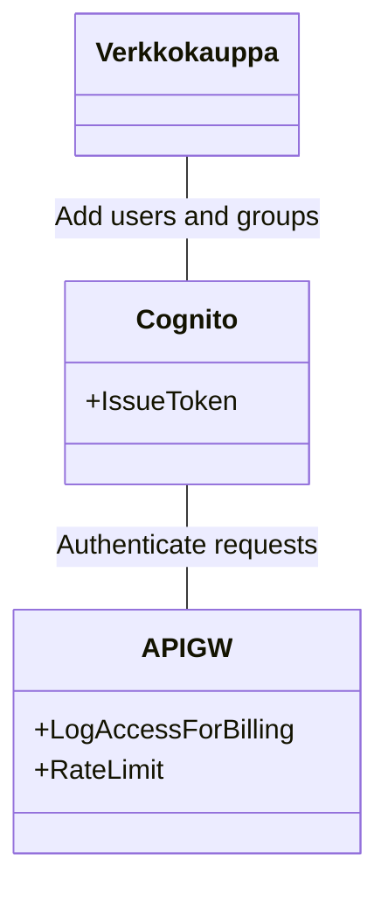

Avainsanat: PowerBI, raportit, MQTT, WebShop
azure powerBi ?
rate limits per customer, can it be done in azure?
certificates to ensure authenticity per customer, other measures?
PowerBI, mutta tuskin haluavat olla vain microsoft-ekosysteemissä

### Digital data marketplace
Tämä tuntuu olevan kuvion pihvi, keino jolla datasettejä saadaan esille ja myytyä. Esimerkkinä [AWS Data Exchange](https://aws.amazon.com/data-exchange/?adx-cards2.sort-by=item.additionalFields.eventDate&adx-cards2.sort-order=desc). 
Rahaa tehdään myymällä kertaluontoisesti taikka myymällä tilauksia.

[OpenDataSoft](https://www.opendatasoft.com/en/partners/)valmis alusta tämän tekemiseen, tosin TietoEvry partnerina.

### Ensimmäinen iteraatio

